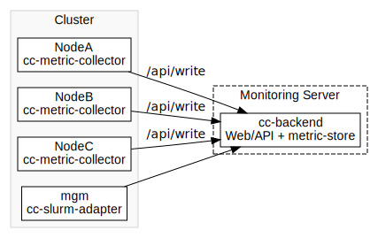

# Einführung

Dieser Guide wurde im Rahmen des Projekts [HPC.NRW](https://hpc.dh.nrw) erstellt und nutzt Beispielkonfigurationen der [FAU Erlangen](https://github.com/ClusterCockpit/cc-examples/tree/main/nhr%40fau) und der Ruhr-Universität Bochum.

Der Guide wird auf Best-effort-Basis aktuell gehalten. Bei Problemen, Fehlern oder Änderungswünschen können gerne [Issues im GitHub-Repository](https://github.com/hpc-nrw/cc-setup-guide/issues) eröffnet werden.

---

## Was ist ClusterCockpit?

ClusterCockpit ist eine moderne, quelloffene Lösung für jobspezifisches Monitoring und die Analyse von HPC-Clustern.  
Ziel von ClusterCockpit ist es, Administratoren und Nutzenden eine umfassende Übersicht über die Auslastung, Effizienz und den Zustand der Clusterressourcen zu bieten, indem es Jobdaten, Performance- und Energiemetriken sowie weitere Statistiken kombiniert.

ClusterCockpit wird an der [Friedrich-Alexander-Universität Erlangen-Nürnberg (FAU)](https://www.fau.de/) entwickelt und steht unter einer Open-Source-Lizenz.  
Die offizielle Projektwebseite mit weiteren Ressourcen, Demos, Downloads und Dokumentation befindet sich unter:  
 [https://clustercockpit.org](https://clustercockpit.org)

Ein wichtiger Bestandteil des ClusterCockpit-Setups ist das Monitoring von Low-Level-Hardwaremetriken wie beispielweise FLOPS und Memory-Bandwidth.  
Hierfür wird neben anderen Metrikkollektoren auch [LIKWID](https://github.com/RRZE-HPC/likwid) verwendet. LIKWID wird maßgeblich an der FAU entwickelt und dient der lokalen Analyse und dem Benchmarking von Hardwareleistung.

---

## Komponenten von ClusterCockpit

ClusterCockpit besteht aus mehreren Komponenten, die miteinander kommunizieren und auf verschiedenen Systemen in der Cluster-Infrastruktur installiert werden:

- **cc-backend:**  
  Zentrale Serverkomponente mit Web-Frontend, API, Datenbankanbindung und integriertem Metric-Store.  
  Hier laufen Weboberfläche, Benutzerverwaltung, Konfigurationslogik und die temporäre Zeitreihenhaltung.

- **cc-metric-collector:**  
  Agent, der auf den Compute-Knoten installiert wird.  
  Sammelt Messwerte zu CPU-Last, Speicher, Netzwerk, I/O, u.v.m. und sendet sie an die Write-API von `cc-backend`.

- **cc-slurm-adapter:**  
  Komponente für die Integration von SLURM, damit Metadaten der Jobs (wie Benutzer, Projekt, Allocations) in ClusterCockpit dargestellt werden können.

---

## Typischer Aufbau

Eine übliche Installation besteht aus:

- **dedizierter Monitoring-Server**, auf dem `cc-backend` betrieben wird.
- **Compute-Knoten**, die jeweils `cc-metric-collector` ausführen.
- **SLURM-Management-Knoten**, auf dem zusätzlich der `cc-slurm-adapter` installiert wird.

---

## Was kann ClusterCockpit erfassen?

Die Plattform ist modular aufgebaut und unterstützt u.a. folgende Metriken (abhängig von Hardware und Konfiguration):

- **CPU-Last und Auslastung**
- **Speicherauslastung**
- **Netzwerk- und Filesystem-Performance**
- **Spezialisierte Leistungsmetriken** wie FLOPS und Memory-Bandwidth (über [LIKWID](https://github.com/RRZE-HPC/likwid))
- **GPU- und InfiniBand-Metriken**
- **Eigene/benutzerdefinierte Metriken**

---

## Zielgruppe dieser Anleitung

Diese Anleitung richtet sich an Systemadministratoren, die ClusterCockpit in einer eigenen HPC-Umgebung installieren, konfigurieren und betreiben möchten.

**Vorausgesetzt werden:**

- Grundkenntnisse in Linux-Administration
- SSH-Zugang zu den Zielsystemen
- Grundverständnis für Cluster-Architektur (SLURM, Management- vs. Compute-Knoten)

---

## Wie ist diese Dokumentation aufgebaut?

Diese Anleitung führt Schritt für Schritt durch den gesamten Prozess von der Vorbereitung der Systeme, über die Installation und erste Inbetriebnahme, bis zu fortgeschrittener Konfiguration und Betrieb.  
Praktische Beispiele und Skripte helfen dabei, möglichst schnell zu einem funktionierenden Monitoring zu kommen.

---
