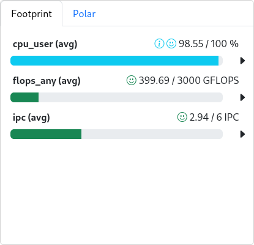
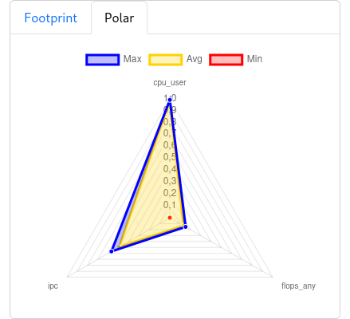

# Receive and display metrics

The collector configured in [Set up cc-metric-collector](cc_metric_collector_setup.md) already sends values, but `cc-backend` only accepts them if the metrics are explicitly configured.
This section shows how to register new or changed metrics on the monitoring server so that

1. the metric store configured in `cc-backend` ingests the data, and
2. the web interface (`cc-backend`) discovers the metrics through entries in `cluster.json`.

> **TL;DR:** Every new metric requires an entry in `metricConfig` inside `cluster.json`. Metric-store runtime settings are configured in `cc-backend/config.json` under `metric-store`.

---

## 1. Check the metric store in `cc-backend`

Default path (following this guide):  
`$INSTALL_DIR/cc-backend/config.json`

The metric store is configured through the `metric-store` section in `cc-backend/config.json`:

```json
"metric-store": {
  "checkpoints": {
    "file-format": "json",
    "directory": "./var/checkpoints"
  },
  "memory-cap": 100,
  "retention-in-memory": "48h",
  "cleanup": {
    "mode": "archive",
    "directory": "./var/archive"
  }
}
```

**Fields**

- `retention-in-memory`: Time window for keeping metric data in memory.
- `checkpoints`: Location and format of checkpoints.
- `cleanup`: Behavior for old data. For 1.5.3, verify the policy used by the installation; upstream still recommends a conservative delete policy if cleanup problems appear.

Restart `cc-backend` afterwards:

```bash
systemctl restart clustercockpit.service
```

---

## 2. Update `cc-backend/cluster.json`

Path:  
`$INSTALL_DIR/cc-backend/var/job-archive/$CLUSTER_NAME/cluster.json`

`cluster.json` describes both subclusters and the metrics shown in the web UI. Every metric is represented by an object inside the `metricConfig` array.

### Minimal entry

```json
{
  "name": "cpu_load",
  "unit": { "base": "" },
  "scope": "node",
  "aggregation": "avg",
  "timestep": 60,
  "peak": 48,
  "normal": 48,
  "caution": 10,
  "alert": 1
}
```

**Key fields**

- `name`: Must exactly match the name published after routing (e.g., after `rename_messages`).
- `unit`: Base unit (optional `prefix`: `"M"`, `"G"`, ...). Keep it consistent with the units defined in `router.json`.
- `scope`: Granularity (`node`, `socket`, `hwthread`, `memoryDomain`, `accelerator`).
- `aggregation`: Typically `avg` for state metrics and `sum` for cumulative ones.
- `timestep`: Display interval (seconds); should match the collector interval.
- `peak`, `normal`, `caution`, `alert`: Thresholds for the UI. Graphs between `normal` and `caution` remain neutral. Values between `caution` and `alert` are highlighted yellow (= keep an eye on it) and values below `alert` red (= immediate action).

### Configuration options

#### Invert the alert logic

Set `"lowerIsBetter": true` if alerts should trigger on *higher* values rather than lower ones. Useful for metrics like `cpu_load_core`, network bandwidth, or IOPS.

#### Show a metric only for specific subclusters

If you want to display GPU metrics only on GPU nodes, remove the metric from the other subclusters:

```json
            "name": "nv_compute_processes",
            "unit": {
                "base": "processes"
            },
            "scope": "accelerator",
            "aggregation": "sum",
            "timestep": 60,
            "peak": 100, 
            "normal": 50,
            "caution": 80,
            "alert": 90,
            "subClusters": [
                {
                    "name": "cpu",
                    "remove": true 
                },
                ...
            ]
        },
```

**Note:** Removed metrics disappear from the job view and cannot be selected. In the admin node view you will see blue placeholders indicating that the metric is disabled for that subcluster:


#### Different thresholds per subcluster

If subclusters differ in CPUs, memory, or GPU memory, you can override the thresholds per subcluster. All clusters not listed inherit the defaults from the main object:

```json
        {
            "name": "cpu_load",
            ...
            "subClusters": [
                {
                    "name": "fatcpu",
                    "peak": 96,
                    "normal": 96,
                    "caution": 10,
                    "alert": 1
                },
                ...
            ]
        },
```

#### Define footprint metrics

Add `"footprint": "avg"` (or `sum`, depending on the aggregation) to include the metric in the footprint view and polar plot.

Footprint example:



Polar plot example:



Metrics flagged with `"lowerIsBetter": true` show an arrow pointing left. In this example only metrics with `hwthread` scope are used because they are the most meaningful on shared nodes.

## Example configurations

The following JSON files show a production-style example configuration for a cluster with CPU, GPU, memory, network, and filesystem metrics.

### `cc-backend/config.json`

[Open file](examples/rub/cc-backend/config.json)

<details>
<summary>Show contents</summary>

```json
--8<-- "examples/rub/cc-backend/config.json"
```

</details>

### `job-archive/cluster.json`

[Open file](examples/rub/job-archive/cluster.json)

<details>
<summary>Show contents</summary>

```json
--8<-- "examples/rub/job-archive/cluster.json"
```

</details>

### `cc-metric-collector/config.json`

[Open file](examples/rub/cc-metric-collector/config.json)

<details>
<summary>Show contents</summary>

```json
--8<-- "examples/rub/cc-metric-collector/config.json"
```

</details>

### `cc-metric-collector/router.json`

[Open file](examples/rub/cc-metric-collector/router.json)

<details>
<summary>Show contents</summary>

```json
--8<-- "examples/rub/cc-metric-collector/router.json"
```

</details>

### `cc-metric-collector/sinks.json`

[Open file](examples/rub/cc-metric-collector/sinks.json)

<details>
<summary>Show contents</summary>

```json
--8<-- "examples/rub/cc-metric-collector/sinks.json"
```

</details>
