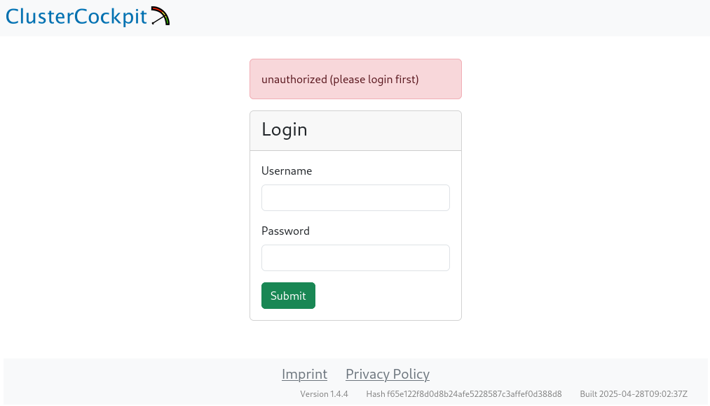
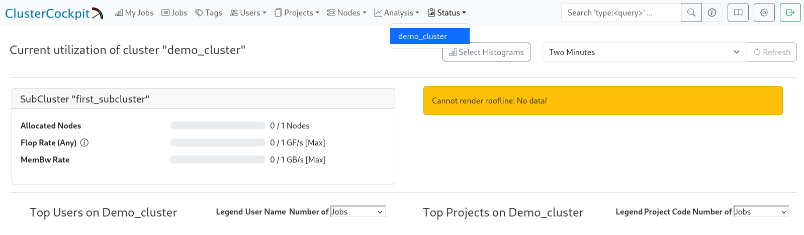

## Erster Login

Nach dem Start der Dienste ist das Webfrontend über folgende URL erreichbar:

* **Standard (während der Installation):**
  http://<Monitoring-Server\>:8080

Die Zugangsdaten für den ersten Login wurden während der Installation erzeugt (Benutzername: `admin`, Passwort siehe Datei `admin_password.txt` im Installationsverzeichnis).

> **Hinweis:**
> Es gibt keine Funktion, das Passwort nach dem Login über die Weboberfläche zu ändern.

**Login Screen:**
   

---

## Übersicht: Webinterface nach Erst-Login

Nach dem erfolgreichen Login sollte die Navigationsleiste oben angezeigt werden.
Der Cluster (`demo_cluster`) wird im Menüpunkt "Status" sichtbar, solange die Datei `cluster.json` vorhanden und valide ist.

**Cluster-Ansicht ("Status" &rarr; "demo_cluster"):**
   

---

## Typische Probleme und Hinweise

* **Keine Navigationsleiste nach Login**

  Prüfen, ob die Datei `cluster.json` im richtigen Verzeichnis liegt und valide ist (Syntax-Fehler, ungültiges JSON).
  Bei fehlerhafter/fehlender `cluster.json` lädt die Weboberfläche nicht korrekt.
  Der Clustername muss in der `cc-backend/config.json` unter `clusters` konfiguriert sein.

* **Fehler "Service nicht erreichbar"**

  Dienste-Status prüfen (`systemctl status ...`), Firewallregeln kontrollieren, Port 8080/443 freigeben.

---

Nach erfolgreichem Login und Sichtprüfung ist das System bereit für die weitere Konfiguration, z. B. das Hinzufügen von Subclustern, Metriken und die Einrichtung der Collectoren.
